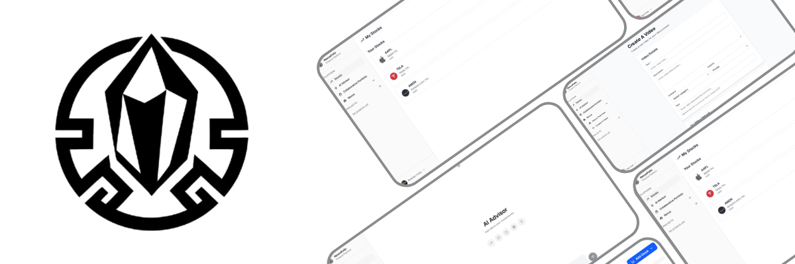

# NexusFolio - AI-Powered Investment Platform

<div align="center">
  
</div>

> **"AI investment advisor that gives personalized advice based on your actual stock portfolio."**

[](https://nextjs.org/)
[](https://www.typescriptlang.org/)
[](https://www.mongodb.com/)
[](https://ai.google.dev/)
[](https://auth0.com/)
[](https://youtu.be/VxCGoeA4PEY)


## Overview

NexusFolio is an AI-powered investment platform that provides personalized financial advice based on your actual stock portfolio. Using advanced RAG (Retrieval-Augmented Generation) technology, it analyzes your holdings, performs semantic search on market data, and delivers contextual investment insights with automated research reports and interactive visualizations.

## Features

- **🤖 Personalized AI Advisor**: Chat with an AI that understands your specific portfolio composition
- **📊 Real-time Portfolio Tracking**: Monitor your stocks with live market data and performance metrics
- **🔍 Automated Stock Research**: Generate comprehensive analysis reports for each holding
- **📈 Interactive Visualizations**: Dynamic charts showing portfolio performance and sector allocation
- **🎯 Contextual Recommendations**: Get investment advice tailored to your actual holdings
- **🔐 Secure Authentication**: Protected user data with enterprise-grade security

## 🏗️ Architecture

### Backend Architecture
- **Next.js 14** with TypeScript for full-stack application
- **MongoDB Atlas** with Mongoose ODM for user portfolio storage
- **Auth0** for secure user authentication and session management
- **Google Gemini 2.0 Flash Lite** for AI-powered responses
- **Vector Database** for semantic search capabilities

### RAG Integration
- **Custom RAG Service** that integrates user portfolios with AI responses
- **Semantic Search Service** for contextual market data retrieval
- **Portfolio Service** for dynamic stock management and analysis
- **Real-time API Endpoints** for chat, portfolio, and stock operations

### Frontend Components
- **React Components** for portfolio visualization and management
- **Interactive Stock Search** with real-time data integration
- **AI Chat Interface** with personalized responses
- **Responsive Design** with modern UI components

### Key Features
- **Portfolio Integration**: AI analyzes your actual stock holdings
- **Automated Research**: Generate detailed stock analysis reports
- **Node Chart Maker**: Create interactive portfolio visualizations
- **Real-time Data**: Live stock prices and market information
- **Personalized Advice**: Contextual recommendations based on your holdings

## 🚧 Challenges

### Technical Challenges
- **Data Integration**: Connecting user-specific portfolio data with generic market information
- **RAG Performance**: Optimizing retrieval-augmented generation for personalized responses
- **Real-time Updates**: Managing live stock data with portfolio synchronization
- **Vector Embeddings**: Implementing semantic search for financial data

### Development Hurdles
- **API Rate Limits**: Managing Google Gemini API usage and response times
- **Database Optimization**: Ensuring fast queries for portfolio operations
- **Error Handling**: Robust error management for financial data
- **User Experience**: Creating intuitive interfaces for complex financial concepts

## 🏆 Accomplishments

- **Personalized AI Integration**: Successfully created a RAG system that provides investment advice based on actual user portfolios
- **Real-time Data Pipeline**: Built a robust system that fetches and processes live stock data
- **User Experience**: Created an intuitive interface for portfolio management and AI interaction
- **Scalable Architecture**: Designed a system that can handle multiple users with personalized data
- **Security Implementation**: Secure authentication and data protection for financial information
- **Automated Research**: AI-generated comprehensive stock analysis reports
- **Interactive Visualizations**: Dynamic charts and graphs for portfolio insights

## 📚 Key Learnings

- **RAG Technology**: Deep understanding of retrieval-augmented generation with user-specific data
- **Financial Data Integration**: Working with real-time stock APIs and portfolio management
- **User Experience in FinTech**: Importance of trust and transparency in financial applications
- **AI Personalization**: Making AI responses truly personalized rather than generic
- **Full-stack Development**: Integration of frontend, backend, database, and AI services
- **Vector Databases**: Implementing semantic search for contextual financial insights

## 🚀 Roadmap

### Short-term (Next 3 months)
- Enhanced portfolio analytics with advanced metrics
- Integration with more stock exchanges and markets
- Improved AI response accuracy with fine-tuned models
- Mobile app development for iOS and Android

### Medium-term (6-12 months)
- Advanced risk assessment and portfolio optimization
- Integration with brokerage accounts for automated trading
- Social features for sharing investment insights
- Multi-language support for global users

### Long-term Vision
- Become the go-to AI investment advisor for retail investors
- Expand to cryptocurrency and alternative investments
- Develop institutional-grade analytics for professional traders
- Create an ecosystem of financial tools and services

## 🛠️ Tech Stack

### Frontend
- **Next.js 14** - Full-stack React framework
- **TypeScript** - Type-safe JavaScript
- **Tailwind CSS** - Utility-first CSS framework
- **React Components** - Modular UI components

### Backend
- **Next.js API Routes** - Serverless backend
- **MongoDB Atlas** - Cloud database
- **Mongoose ODM** - Object document mapping
- **Auth0** - Authentication service

### AI & Data
- **Google Gemini 2.0 Flash Lite** - Generative AI
- **Vector Database** - Semantic search
- **RAG Architecture** - Retrieval-augmented generation
- **Real-time APIs** - Live market data

### Development
- **Git** - Version control
- **pnpm** - Package manager
- **ESLint** - Code linting
- **TypeScript** - Type checking

## Getting Started

### Prerequisites
- Node.js 18+ 
- pnpm package manager
- MongoDB Atlas account
- Google AI API key
- Auth0 account

### Installation

1. **Clone the repository**
```bash
git clone https://github.com/yourusername/nexusfolio.git
cd nexusfolio
```

2. **Install dependencies**
```bash
pnpm install
```

3. **Environment setup**
```bash
cp .env.example .env.local
```

4. **Configure environment variables**
```env
# Database
MONGODB_URI=your_mongodb_connection_string

# Authentication
AUTH0_SECRET=your_auth0_secret
AUTH0_BASE_URL=http://localhost:3000
AUTH0_ISSUER_BASE_URL=your_auth0_domain
AUTH0_CLIENT_ID=your_auth0_client_id
AUTH0_CLIENT_SECRET=your_auth0_client_secret

# AI Services
GEMINI_API_KEY=your_gemini_api_key

# API Configuration
NEXT_PUBLIC_API_URL=http://localhost:3000
```

5. **Run the development server**
```bash
pnpm dev
```

6. **Open your browser**
Navigate to [http://localhost:3000](http://localhost:3000)

## Project Structure

```
nexusfolio/
├── apps/
│   └── web/
│       ├── app/
│       │   ├── api/                 # API routes
│       │   │   ├── chat/            # RAG chat endpoint
│       │   │   ├── portfolio/      # Portfolio data API
│       │   │   └── user-stocks/     # Stock management API
│       │   ├── dashboard/           # Main dashboard
│       │   └── layout.tsx           # Root layout
│       ├── components/
│       │   ├── ai-advisor/         # AI chat components
│       │   ├── stocks-portfolio.tsx # Portfolio display
│       │   └── manual-stock-modal.tsx # Stock addition
│       ├── lib/
│       │   ├── rag-service.ts       # RAG implementation
│       │   ├── portfolio.ts         # Portfolio service
│       │   ├── semantic-search.ts   # Semantic search
│       │   └── vector-store.ts      # Vector database
│       ├── models/
│       │   └── Stock.ts             # MongoDB model
│       └── utils/
│           └── dbConnect.ts          # Database connection
```

## API Endpoints

### Chat API
- **POST** `/api/chat` - Generate AI responses with portfolio context

### Portfolio API
- **GET** `/api/portfolio` - Fetch user's portfolio data
- **POST** `/api/user-stocks` - Add stock to portfolio
- **DELETE** `/api/user-stocks` - Remove stock from portfolio

### Stock Data API
- **GET** `/api/stockQuote` - Get real-time stock data
- **GET** `/api/searchStock` - Search for stocks

## AI Integration

### RAG Service
The RAG (Retrieval-Augmented Generation) service combines:
- **User Portfolio Data** - Actual stock holdings and preferences
- **Market Information** - Real-time stock data and news
- **Semantic Search** - Contextual market insights
- **AI Responses** - Personalized investment advice

### Semantic Search
- **Vector Database** for market data retrieval
- **Contextual Relevance** for better AI responses
- **Real-time Updates** with live market information

## Security

- **Auth0 Authentication** - Enterprise-grade user management
- **Data Encryption** - Secure financial data storage
- **API Rate Limiting** - Prevent abuse and ensure performance
- **Input Validation** - Sanitize user inputs
- **Session Management** - Secure user sessions

## Performance

- **Real-time Updates** - Live stock data synchronization
- **Optimized Queries** - Fast database operations
- **Caching Strategy** - Reduced API calls and improved performance
- **Error Handling** - Robust error management
- **Scalability** - Designed for multiple concurrent users

## Testing

```bash
# Run tests
pnpm test

# Run linting
pnpm lint

# Type checking
pnpm type-check
```

## Deployment

### Vercel (Recommended)
1. Connect your GitHub repository to Vercel
2. Configure environment variables
3. Deploy automatically on push to main branch

### Manual Deployment
```bash
# Build the application
pnpm build

# Start production server
pnpm start
```

## Contributing

1. Fork the repository
2. Create a feature branch (`git checkout -b feature/amazing-feature`)
3. Commit your changes (`git commit -m 'Add amazing feature'`)
4. Push to the branch (`git push origin feature/amazing-feature`)
5. Open a Pull Request

## License

This project is licensed under the MIT License - see the [LICENSE](LICENSE) file for details.

## Acknowledgments

- **Google AI** for Gemini API
- **MongoDB** for Atlas database
- **Auth0** for authentication
- **Next.js** team for the amazing framework
- **OpenAI** for inspiration on RAG architecture

## Support

- **Documentation**: [Github Docs](https://github.com/forcedrift/nexusfolio/)
- **Issues**: [GitHub Issues](https://github.com/forcedrift/nexusfolio/issues)

---

**Built with <3 by the NexusFolio team**

*Empowering investors with AI-driven insights*
